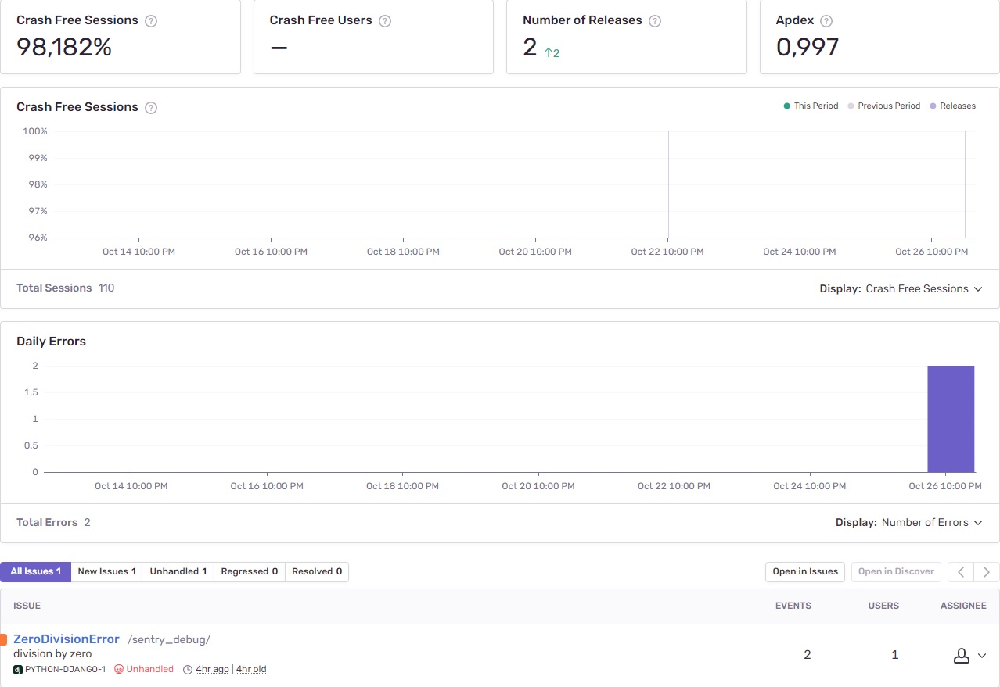

### Summary:
Site web d'Orange County Lettings
Orange County Lettings (OC Lettings) is a start-up specialized in real estate rental business. The start-up is in the midst of expansion in the United States.

This project consists in refactoring OC Lettings website application code and deploying it on Heroku using a Docker container and a CI/CD pipeline. The website reflecting the result of the refactoring and deployment is available at the following address:

https://oclettingswebapp.herokuapp.com/

### Technical background:
The project uses the following technologies:

- `Python` as the programming language
- `Django` as a web framework
- `Pytest` and Coverage for testing
- `Docker` for containerization
- `CircleCI` for Continuous Integration
- `Heroku` for Deployment
- `Sentry` for monitoring

### Local Deployment:
`python` is required to run the website.

1. Clone this repository (or download the code as a zip file), navigate to the root folder of the repository, create and activate a virtual environment, install project dependencies

- `git clone https://github.com/Call-X/Python-OC-Lettings-FR.git`
- `cd src`
- `python -m venv env`
- `source env/bin/activate`
- `pip install -r requirements.txt`

2. Exécuter le site

- `cd /path/to/Python-OC-Lettings-FR`
- `source venv/bin/activate`
- `pip install --requirement requirements.txt`
- `python manage.py runserver`
### Usage:
The website is available from the following address:
`http://localhost:8000`
### Linting:
- `cd /path/to/Python-OC-Lettings-FR`
- `source venv/bin/activate`
- `flake8`

### Tests unitaires:
- `cd /path/to/Python-OC-Lettings-FR`
- `source venv/bin/activate`
- `pytest`

### Base de données:
- `cd /path/to/Python-OC-Lettings-FR`
- Ouvrir une session shell `sqlite3`
- Se connecter à la base de données `.open oc-lettings-site.sqlite3`
- Afficher les tables dans la base de données `.tables`
- Afficher les colonnes dans le tableau des profils, `pragma table_info(Python-OC-Lettings-FR_profile);`
- Lancer une requête sur la table des profils, `select user_id, favorite_city from
  Python-OC-Lettings-FR_profile where favorite_city like 'B%';`
- `.quit` pour quitter

### Administration:
Only users with the status superuser can log in to the admin site.
The application comes with an administration site:
`http://localhost:8000/admin`
### Testing:
The test suite can be run using the following command:
`pytest`

The coverage report can be generated using the following command:
`coverage run -m pytest`

The html report can be generated with the following command:
`coverage html`

### Local deployment using Docker CLI:
The repository contains a `Dockerfile` that allows to easily build a Docker container and locally run the application. The same container can be used for deployement for production.

1. Download and install `https://docs.docker.com/engine/install/` according to your system requirement.

2. Navigate to the application root folder and build the container named `oc-lettings`:
`docker build -t oclettings:v1 .`

3. Run the container locally:
`docker run --publish 8000:8000 oclettings:v1`

The website can now be accessed locally from a web browser at `http://127.0.0.1:8000`
### Deployement using Heroku CLI:
The application is pre-configured to be deployed on Heroku for production. This procedure assumes that you already have created locally a container named `oclettings` as described above.

1. Create a user account on `https://heroku.com/`

2. Download and install `https://devcenter.heroku.com/articles/heroku-cli#download-and-install`

3. Login and create a new Heroku app (replace `<app_name>` with the app name you choose)

4. Login to the Heroku container registry:
`heroku container:login`

5. Create a new Heroku app:
`heroku create <app_name>`

6. Push the container:
`heroku container:push web -a=<HEROKU_APP_NAME>`

7. Configure the Django secret key as an environment variable (replace `<your_secret_key>` with your secret key):
`heroku config:add SECRET_KEY=<your_secret_key>-a <app_name>`

8. Configure the Django ALLOWED_HOSTS as an environment variable (replace `<your_ALLOWED_HOSTS>` with your secret ALLOWED_HOSTS):
`heroku config:add ALLOWED_HOSTS='<your_ALLOWED_HOSTS>' -a <app_name>`

9. Release the application:
`heroku container:release -a <HEROKU_APP_NAME> web`

10. Open the application on the web:
`heroku open -a=<HEROKU_APP_NAME>`

You can now check the website from the following address: 
`https://<app_name>.herokuapp.com.`
### Deployment using CircleCI CI/CD Pipeline:
The pipeline created for the project is available at the following address: 
`https://app.circleci.com/pipelines/github/Call-X/Python-OC-Lettings-FR/`

The repository container a configuration file for CircleCI : `.circleci/config.yml.` This files implements the following workflow:

. build:
  - builds a docker container image incorporating Python 3.9 based on CircleCi legacy language images
  - creates a virtual environment, install 3rd party packages required for the project.
  - saves the environment in the cache
. test:
  - builds the CircleCI Python 3.9 docker image and restore the environment from the cache
  - run the test suite using the command `pytest`
  the testing starts only after the job build is successfully completed
. linting:
  - builds the CircleCI Python 3.9 docker image and restore the environment from the cache
  - run the quality check using the command `flake8`
  the linting starts only after the job build is successfully completed
. package:
  - builds the CircleCI Python 3.9 docker image and restore the environment from the cache
  - builds a Docker container according to the requirements of the file Dockerfile
  - pushes the Docker container to the Dockerhub
  the package job starts only after the jobs test and linting are successfully completed
. deploy:
  - pulls the Docker container previously build from the Dockerhub
  - tags the Docker container as required to push the container to the Heroku container registry
  - pushes the Docker container to the Heroku container registry
  - releases the Heroku application
  the deploy job starts only after the job deploy is successfully completed
  The jobs build, test, linting are automatically performed everytime a new commit is pushed to the Github repository.

The jobs package, deploy are automatically performed everytime a new commit of the branch main is pushed to the Github repository.

### Monitoring using Sentry:
A simple surveillance process is implemented. The navigation to the page 
`/sentry-debug` will raise a server error that will be captured as an issue in a sentry project.

The project Data Source Name (DSN) shall be stored in the environment variable SENTRY_DSN in Heroku (replace <your_DSN> by your project DSN and <app_name> by the Heroku app name):

`heroku config:add SENTRY_DSN='<your_DSN>' -a <app_name>`

The sentry issue report is available at the following adress:
https://sentry.io/share/issue/0989008d79064395bbeb8e690eb56919/
